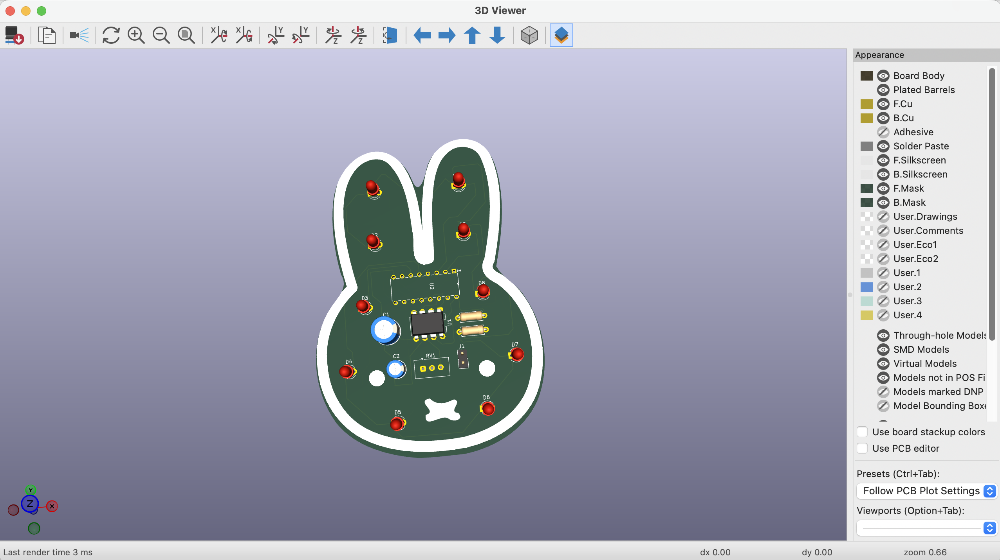

# miffy-blinky! 🐰✨

This is my first PCB project. I made a custom Miffy-shaped blinky keychain following Hack Club's Stasis project started guide! 

Coming from mostly web dev and frontend stuff, jumping into KiCad was definitely an experience. It turns out making a PCB is basically like doing UI design, except the components actually take up physical space and you can't just z index them away lol. 

### Things I learned (and struggled with tbh)
* I learned how to physically route components on the PCB.
* I imported a custom DXF drawing for Miffy's face, but it wouldn't show up in the 3D viewer. Turns out CAD lines have a 0mm thickness by default, so I had to manually set the ink to 0.2mm so the factory actually prints it!
* Drawing the copper tracks is honestly like a puzzle game. You can't cross a front wire over another front wire without shorting the board, but you can drop a pin and draw on the back layer to go underneath. 

Super proud of how this turned out!

---

### This project was made for Hack Club's Stasis event.

